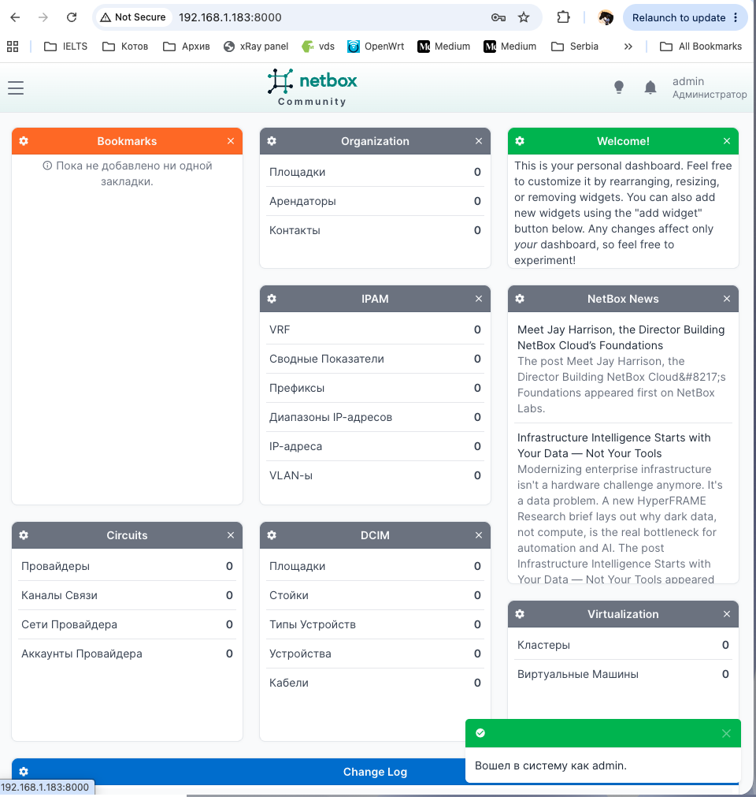
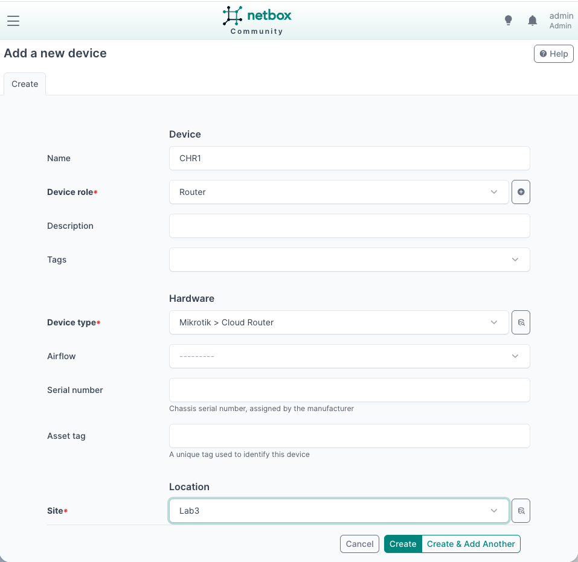
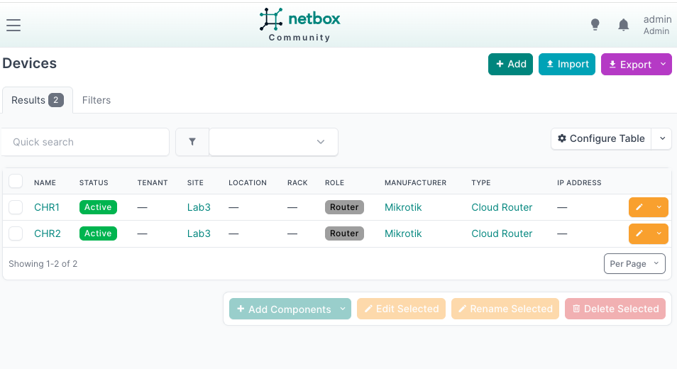
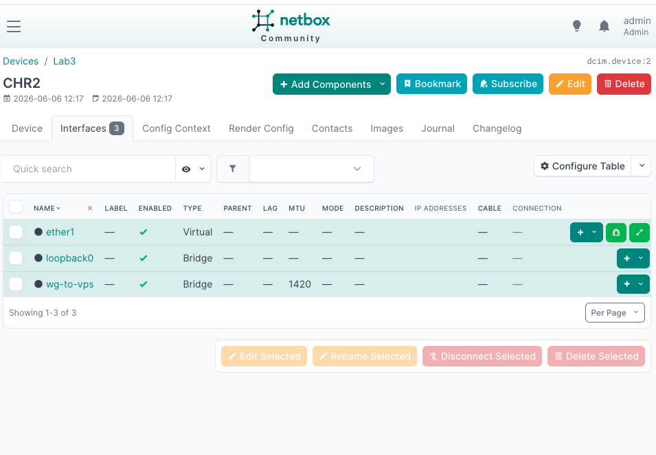
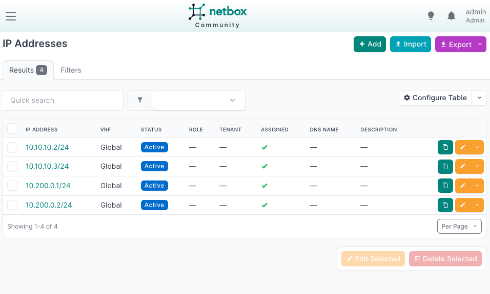
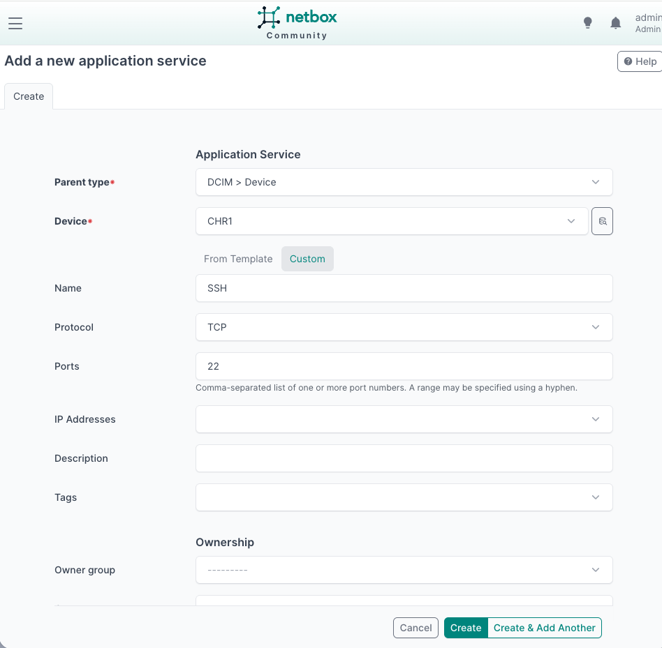
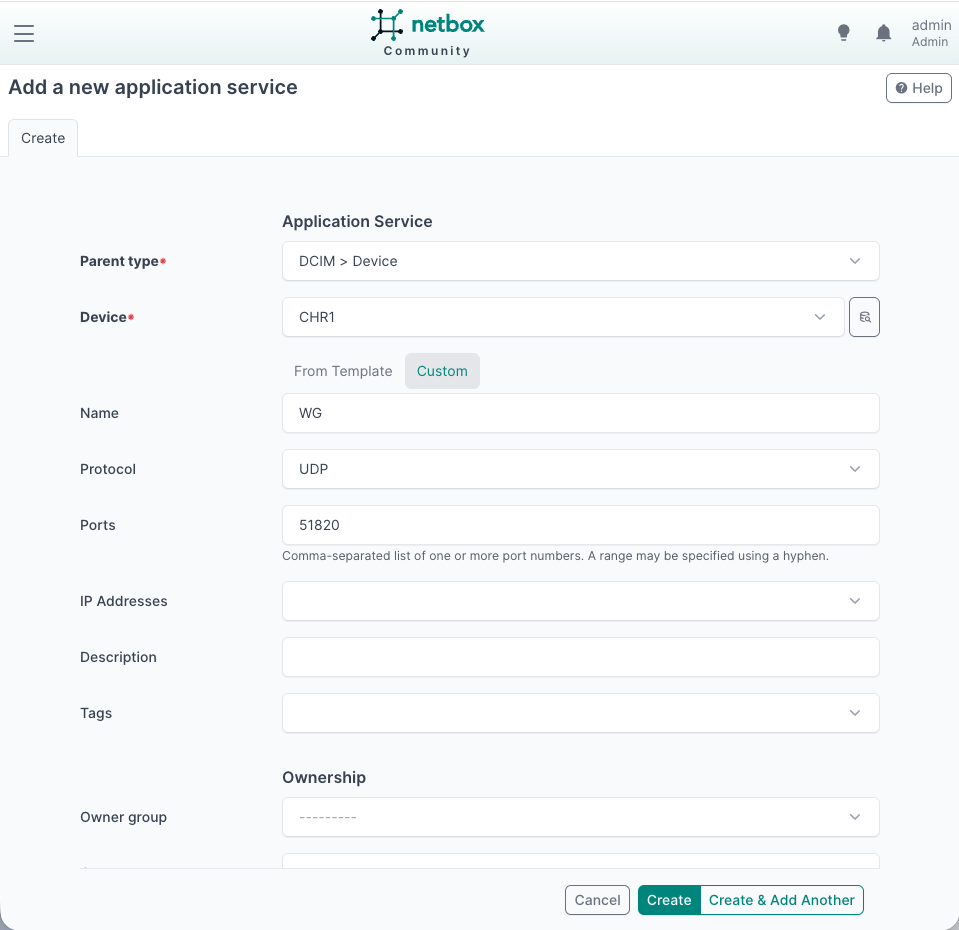
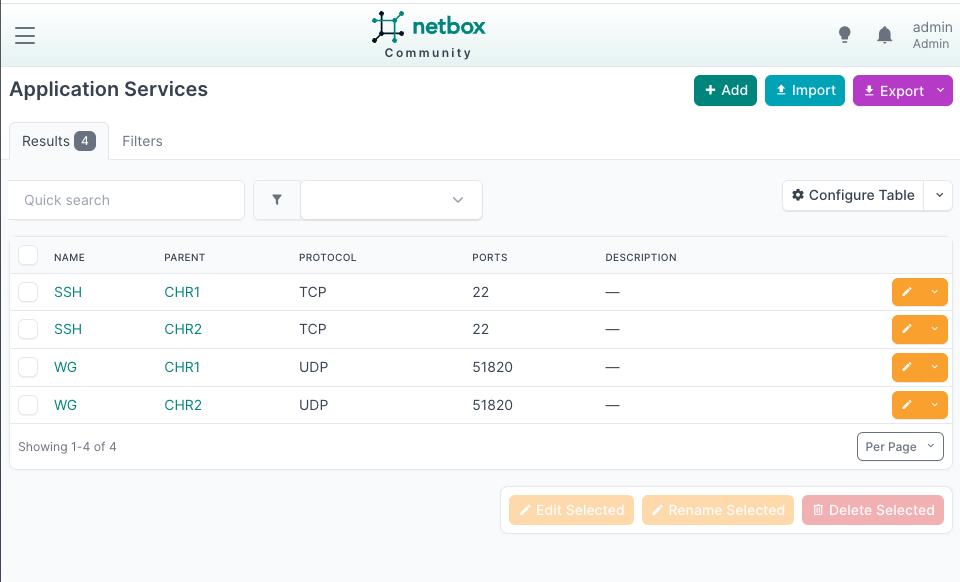
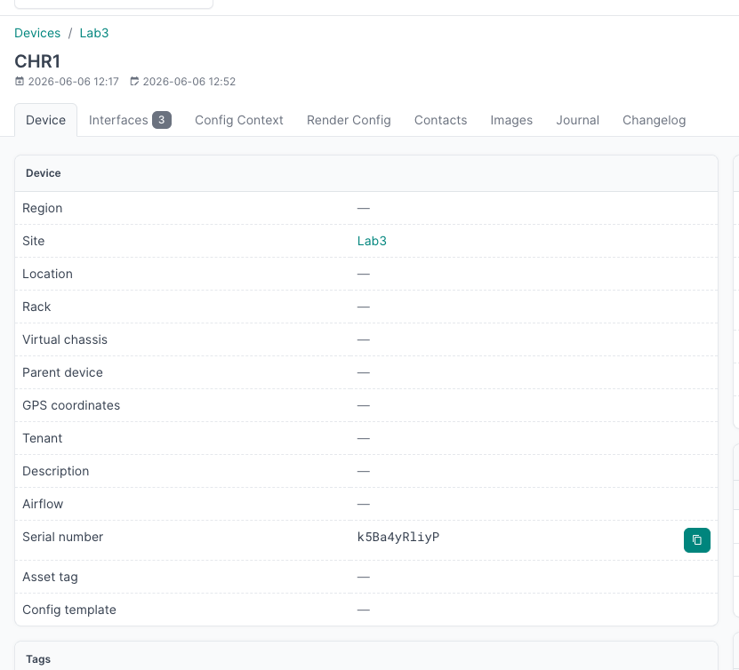

University: [ITMO University](https://itmo.ru/ru/)  
Faculty: [FICT](https://fict.itmo.ru)  
Course: [Introduction in routing](https://github.com/itmo-ict-faculty/network-programming)  
Year: 2025/2026  
Group: K3323  
Author: Ivanova Ekaterina Andreevna  
Lab: Lab3  
Date of creation:  
Date of finish:  

---

## Лабораторная работа №3 "Развёртывание Netbox, сбор данных об устройствах и их конфигурация"

### Описание

В данной лабораторной работе вы ознакомитесь с интеграцией Ansible и Netbox и изучите методы сбора информации с помощью данной интеграции.

### Цель работы

С помощью Ansible и Netbox собрать всю возможную информацию об устройствах и сохранить их в отдельном файле.

---

### Ход работы

#### 1. Развёртывание Netbox на дополнительной VM

Netbox был развёрнут на отдельной виртуальной машине (Debian, UTM) с использованием Docker Compose. Для доступа с VPS была настроена связь через WireGuard-туннель — Debian VM добавлена в туннель как отдельный peer с адресом `10.10.10.4/24`.

```bash
git clone -b release https://github.com/netbox-community/netbox-docker.git
cd netbox-docker

cat > docker-compose.override.yml << 'EOF'
services:
  netbox:
    ports:
      - 8000:8080
    environment:
      SUPERUSER_NAME: admin
      SUPERUSER_PASSWORD: xxx
EOF

docker-compose up -d
```

Суперпользователь создан вручную:

```bash
docker-compose exec netbox /opt/netbox/netbox/manage.py createsuperuser
```

Netbox доступен по адресу `http://192.168.1.183:8000`.



---

#### 2. Заполнение информации об устройствах в Netbox

В Netbox были созданы следующие сущности:

- **Site**: Lab3
- **Manufacturer**: Mikrotik
- **Device Type**: Cloud Router
- **Device Role**: Router
- **Devices**: CHR1, CHR2





Для каждого устройства добавлены интерфейсы:

| Name | Type | MTU |
|------|------|-----|
| ether1 | Virtual | — |
| loopback0 | Bridge | — |
| wg-to-vps | Bridge | 1420 |



IP-адреса добавлены через IPAM и привязаны к соответствующим интерфейсам:

| Устройство | Интерфейс | IP-адрес |
|------------|-----------|----------|
| CHR1 | wg-to-vps | 10.10.10.2/24 |
| CHR2 | wg-to-vps | 10.10.10.3/24 |
| CHR1 | loopback0 | 10.200.0.1/24 |
| CHR2 | loopback0 | 10.200.0.2/24 |



Для каждого устройства добавлены сервисы SSH (TCP/22) и WireGuard (UDP/51820):







Дополнительные настройки (NTP, OSPF, WireGuard) добавлены через **Config Context** в формате JSON для каждого устройства.

**CHR1 Config Context:**
```json
{
    "ntp": {
        "enabled": true,
        "servers": ["pool.ntp.org", "0.ru.pool.ntp.org"]
    },
    "ospf": {
        "instances": [{
            "areas": [{
                "interfaces": ["10.10.10.0/24"],
                "name": "backbone",
                "type": "ptp"
            }],
            "name": "inst"
        }],
        "router_id": "1.1.1.1"
    },
    "wireguard": {
        "listen_port": 51820,
        "mtu": 1300,
        "public_key": "",
        "peers": [{
            "public_key": "",
            "endpoint": "x.x.x.x:51820",
            "allowed_address": "10.10.10.0/24"
        }]
    }
}
```

**CHR2 Config Context:**
```json
{
    "ntp": {
        "enabled": true,
        "servers": ["pool.ntp.org", "0.ru.pool.ntp.org"]
    },
    "ospf": {
        "instances": [{
            "areas": [{
                "interfaces": ["10.10.10.0/24"],
                "name": "backbone",
                "type": "ptp"
            }],
            "name": "inst"
        }],
        "router_id": "2.2.2.2"
    },
    "wireguard": {
        "listen_port": 51821,
        "mtu": 1300,
        "public_key": "",
        "peers": [{
            "public_key": "",
            "endpoint": "x.x.x.x:51820",
            "allowed_address": "10.10.10.0/24"
        }]
    }
}
```

---

#### 3. Сбор данных из Netbox с помощью Ansible

Установлена коллекция и настроен inventory-плагин:

```bash
ansible-galaxy collection install netbox.netbox
pip install pytz
```

`inventory.yml`:
```yaml
plugin: netbox.netbox.nb_inventory
api_endpoint: http://10.10.10.4:8000
token: <netbox_api_token>
validate_certs: false
config_context: true
```

Данные сохранены в файл:

```bash
ansible-inventory -i inventory.yml --list > netbox_data.json
```

Фрагмент полученного файла `netbox_data.json`:

```json
{
    "_meta": {
        "hostvars": {
            "CHR1": {
                "config_context": [
                    {
                        "ntp": {
                            "enabled": true,
                            "servers": [
                                "pool.ntp.org",
                                "0.ru.pool.ntp.org"
                            ]
                        },
                        "ospf": {
                            "instances": [
                                {
                                    "areas": [
                                        {
                                            "interfaces": [
                                                "10.10.10.0/24"
                                            ],
                                            "name": "backbone",
                                            "type": "ptp"
                                        }
                                    ],
                                    "name": "inst"
                                }
                            ],
                            "router_id": "1.1.1.1"
                        },
                        "wireguard": {
                            "listen_port": 51820,
                            "mtu": 1300,
                            "peers": [
                                {
                                    "allowed_address": "10.10.10.0/24",
```

---

#### 4. Сценарий настройки CHR на основе данных из Netbox

Плейбук `configure_chr.yml` получает имя устройства и primary IP из Netbox и применяет их на роутерах:

```yaml
---
- name: Configure CHR from Netbox
  hosts: mikrotik
  gather_facts: no

  vars:
    netbox_url: "http://10.10.10.4:8000"
    netbox_token: "<netbox_api_token>"

  tasks:
    - name: Get device info from Netbox
      uri:
        url: "{{ netbox_url }}/api/dcim/devices/?name={{ inventory_hostname }}"
        headers:
          Authorization: "Token {{ netbox_token }}"
        return_content: yes
      register: netbox_device
      delegate_to: localhost

    - name: Set device facts
      set_fact:
        device_name: "{{ netbox_device.json.results[0].name }}"
        device_ip: "{{ netbox_device.json.results[0].primary_ip.address | default('') }}"

    - name: Set device name
      community.routeros.command:
        commands:
          - /system identity set name="{{ device_name }}"

    - name: Add IP address to wg-to-vps interface
      community.routeros.command:
        commands:
          - /ip address add address="{{ device_ip }}" interface=wg-to-vps comment="from-netbox"
      when: device_ip != ''
```

Результат выполнения:

```
PLAY [Configure CHR from Netbox] *******************************************************

TASK [Get device info from Netbox] *****************************************************
ok: [chr2 -> localhost]
ok: [chr1 -> localhost]

TASK [Set device facts] ****************************************************************
ok: [chr1]
ok: [chr2]

TASK [Set device name] *****************************************************************
changed: [chr1]
changed: [chr2]

TASK [Add IP address to wg-to-vps interface] *******************************************
changed: [chr1]
changed: [chr2]

PLAY RECAP *****************************************************************************
chr1 : ok=4  changed=2  unreachable=0  failed=0  skipped=0  rescued=0  ignored=0
chr2 : ok=4  changed=2  unreachable=0  failed=0  skipped=0  rescued=0  ignored=0
```

---

#### 5. Сценарий сбора серийного номера и записи в Netbox

Плейбук `serial_number.yml` собирает system-id с каждого CHR и записывает его в поле Serial Number в Netbox:

```yaml
---
- name: Collect serial number and update Netbox
  hosts: mikrotik
  gather_facts: no

  vars:
    netbox_url: "http://10.10.10.4:8000"
    netbox_token: "<netbox_api_token>"

  tasks:
    - name: Get serial number from CHR
      community.routeros.command:
        commands:
          - /system license print
      register: license_output

    - name: Parse serial number
      set_fact:
        serial_number: "{{ license_output.stdout[0] | regex_search('system-id: (\\S+)', '\\1') | first }}"

    - name: Get device ID from Netbox
      uri:
        url: "{{ netbox_url }}/api/dcim/devices/?name={{ inventory_hostname }}"
        headers:
          Authorization: "Token {{ netbox_token }}"
        return_content: yes
      register: netbox_device
      delegate_to: localhost

    - name: Update serial number in Netbox
      uri:
        url: "{{ netbox_url }}/api/dcim/devices/{{ netbox_device.json.results[0].id }}/"
        method: PATCH
        headers:
          Authorization: "Token {{ netbox_token }}"
          Content-Type: "application/json"
        body_format: json
        body:
          serial: "{{ serial_number }}"
      delegate_to: localhost
```

Результат выполнения:

```
PLAY [Collect serial number and update Netbox] *****************************************

TASK [Get serial number from CHR] ******************************************************
changed: [chr2]
changed: [chr1]

TASK [Parse serial number] *************************************************************
ok: [chr1]
ok: [chr2]

TASK [Get device ID from Netbox] *******************************************************
ok: [chr1 -> localhost]
ok: [chr2 -> localhost]

TASK [Update serial number in Netbox] **************************************************
ok: [chr1 -> localhost]
ok: [chr2 -> localhost]

PLAY RECAP *****************************************************************************
chr1 : ok=4  changed=1  unreachable=0  failed=0  skipped=0  rescued=0  ignored=0
chr2 : ok=4  changed=1  unreachable=0  failed=0  skipped=0  rescued=0  ignored=0
```

Серийный номер успешно записан в Netbox:



### Вывод

В ходе лабораторной работы был развёрнут Netbox на отдельной виртуальной машине и настроена его интеграция с Ansible через WireGuard-туннель. В Netbox внесена информация об обоих CHR: интерфейсы, IP-адреса, сервисы и конфигурационный контекст. С помощью Ansible реализованы три сценария: сбор данных из Netbox в файл, настройка устройств на основе данных из Netbox (изменение имени, добавление IP), а также сбор серийных номеров с устройств и их запись обратно в Netbox.
