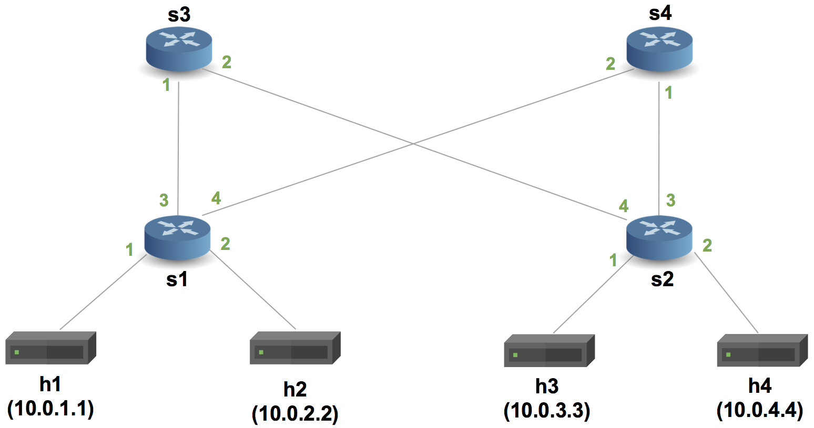
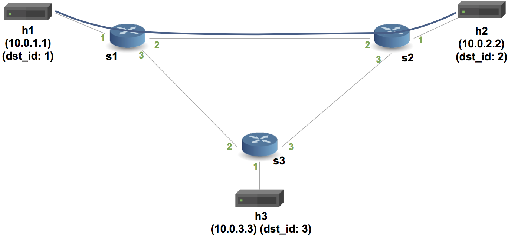

University: [ITMO University](https://itmo.ru/ru/)  
Faculty: [FICT](https://fict.itmo.ru)  
Course: [Introduction in routing](https://github.com/itmo-ict-faculty/network-programming)  
Year: 2025/2026  
Group: K3323  
Author: Ivanova Ekaterina Andreevna  
Lab: Lab4  
Date of creation:  
Date of finish:  

---

## Лабораторная работа №4 "Базовая 'коммутация' и туннелирование используя язык программирования P4"

### Описание

В данной лабораторной работе осуществляется знакомство на практике с языком программирования P4, разработанным компанией Barefoot (ныне Intel) для организации процесса обработки сетевого трафика на скорости чипа.

### Цель работы

Изучить синтаксис языка программирования P4 и выполнить 2 обучающих задания от Open Network Foundation для ознакомления на практике с P4.

---

### Ход работы

#### Подготовка среды

Поскольку рабочая машина имеет архитектуру ARM (Apple M1), использование Vagrant и VirtualBox невозможно — VirtualBox не поддерживает ARM. В качестве альтернативы была использована виртуальная машина на VPS с архитектурой x86_64 (KVM-виртуализация) под управлением Ubuntu 22.04 LTS.

Тип виртуализации проверен командой:

```bash
systemd-detect-virt
```

```
kvm
```

Был склонирован репозиторий p4lang/tutorials:

```bash
git clone https://github.com/p4lang/tutorials.git
cd tutorials
```

Вместо `vagrant up` запущены bootstrap-скрипты из директории `vm-ubuntu-20.04` напрямую на VPS — они содержат ту же логику установки окружения, которую Vagrant выполнял бы внутри VM:

```bash
cd ~/tutorials/vm-ubuntu-20.04
bash root-common-bootstrap.sh
bash root-dev-bootstrap.sh
bash user-dev-bootstrap.sh
```

Поскольку скрипт `user-dev-bootstrap.sh` завершился с ошибкой при сборке p4c (недоступен GitHub для загрузки libbpf), компиляция p4c была выполнена вручную с отключённым eBPF-бэкендом:

```bash
cd ~/tutorials/vm-ubuntu-20.04/p4c/build
cmake .. -DENABLE_EBPF=OFF -DENABLE_UBPF=OFF
make -j2
make install
```

Проверка установки:

```bash
p4c --version
simple_switch --version
```

```
p4c 1.2.4.16 (SHA: 09b4e63270 BUILD: Release)
1.15.0-28b736ca
```

---

#### Часть 1. Implementing Basic Forwarding

Задание: реализовать IPv4-форвардинг на P4-коммутаторе. Коммутатор должен обновлять MAC-адреса, декрементировать TTL и передавать пакет на нужный порт согласно таблице маршрутизации.



Переход в директорию задания:

```bash
cd ~/tutorials/exercises/basic
```

Запуск незавершённого скелета для проверки исходного поведения:

```bash
make run
```

```
mininet> h1 ping h2 -c 4
PING 10.0.2.2 (10.0.2.2) 56(84) bytes of data.

--- 10.0.2.2 ping statistics ---
4 packets transmitted, 0 received, 100% packet loss, time 3054ms
```

Скелет `basic.p4` дропает все пакеты — ожидаемое поведение до реализации логики.

В файл [`configs/basic.p4`](basic.p4) добавлены:

- парсер Ethernet и IPv4
- действие `ipv4_forward`: установка egress-порта, обновление MAC-адресов, декремент TTL
- таблица `ipv4_lpm` с LPM-матчингом по dst IP
- депарсер

После реализации:

```bash
make run
```

```
mininet> h1 ping h2 -c 4
PING 10.0.2.2 (10.0.2.2) 56(84) bytes of data.
64 bytes from 10.0.2.2: icmp_seq=1 ttl=63 time=0.771 ms
64 bytes from 10.0.2.2: icmp_seq=2 ttl=63 time=0.689 ms
64 bytes from 10.0.2.2: icmp_seq=3 ttl=63 time=0.708 ms
64 bytes from 10.0.2.2: icmp_seq=4 ttl=63 time=0.704 ms

--- 10.0.2.2 ping statistics ---
4 packets transmitted, 4 received, 0% packet loss, time 3070ms
rtt min/avg/max/mdev = 0.689/0.718/0.771/0.031 ms
```

```
mininet> pingall
*** Ping: testing ping reachability
h1 -> h2 h3 h4 
h2 -> h1 h3 h4 
h3 -> h1 h2 h4 
h4 -> h1 h2 h3 
*** Results: 0% dropped (12/12 received)
```

Все хосты топологии успешно достигают друг друга, потерь нет.

---

#### Часть 2. Implementing Basic Tunneling

Задание: расширить P4-программу поддержкой кастомного туннельного заголовка `myTunnel`. При наличии заголовка коммутатор должен маршрутизировать пакет по полю `dst_id`, игнорируя IP-адрес назначения.



Переход в директорию задания:

```bash
cd ~/tutorials/exercises/basic_tunnel
```

В файл [`configs/basic_tunnel.p4`](basic_tunnel.p4) добавлены:

- заголовок `myTunnel_t` с полями `proto_id` и `dst_id`
- состояние парсера `parse_myTunnel` (при `etherType = 0x1212`)
- действие `myTunnel_forward`: установка egress-порта по `dst_id`
- таблица `myTunnel_exact` с exact-матчингом по `dst_id`
- логика apply: если заголовок myTunnel валиден — применяется туннельная таблица, иначе — IP-таблица

```bash
make run
```

Тест туннелированного пакета (h1 → h2, dst_id=2):

```
mininet> h2 ./receive.py &
mininet> h1 ./send.py 10.0.2.2 "P4 is cool" --dst_id 2
```

```
sending on interface eth0 to dst_id 2
###[ Ethernet ]### 
  dst       = ff:ff:ff:ff:ff:ff
  src       = 08:00:00:00:01:11
  type      = 0x1212
###[ MyTunnel ]### 
     pid       = 2048
     dst_id    = 2
###[ IP ]### 
        src       = 10.0.1.1
        dst       = 10.0.2.2
        ttl       = 64
###[ Raw ]### 
           load      = 'P4 is cool'
```

Тест обычного IP-пакета (без туннеля):

```
mininet> h1 ./send.py 10.0.2.2 "P4 is cool"
```

```
sending on interface eth0 to IP addr 10.0.2.2
###[ Ethernet ]### 
  dst       = ff:ff:ff:ff:ff:ff
  src       = 08:00:00:00:01:11
  type      = IPv4
###[ IP ]### 
     src       = 10.0.1.1
     dst       = 10.0.2.2
     ttl       = 64
###[ Raw ]### 
        load      = 'P4 is cool'
```

Вывод `receive.py` на h2 — оба пакета получены:

```
got a packet
###[ Ethernet ]### 
  type      = 0x1212
###[ MyTunnel ]### 
     pid       = 2048
     dst_id    = 2
###[ IP ]### 
        ttl       = 64
        src       = 10.0.1.1
        dst       = 10.0.2.2
###[ Raw ]### 
           load      = 'P4 is cool'

got a packet
###[ Ethernet ]### 
  dst       = 08:00:00:00:02:22
  src       = 08:00:00:00:02:00
  type      = IPv4
###[ IP ]### 
     ttl       = 62
     src       = 10.0.1.1
     dst       = 10.0.2.2
###[ Raw ]### 
        load      = 'P4 is cool'
```

Ключевое различие: туннелированный пакет имеет `type = 0x1212` и TTL=64 (коммутация по dst_id без IP-обработки), обычный IP-пакет имеет `type = IPv4` и TTL=62 (прошёл через 2 коммутатора с декрементом TTL).

---

### Вывод

В ходе лабораторной работы было развёрнуто P4-окружение (p4c, bmv2, mininet) на VPS с Ubuntu 22.04 в качестве альтернативы Vagrant/VirtualBox. Реализованы два P4-упражнения: базовый IPv4-форвардинг с LPM-таблицей и базовое туннелирование с кастомным заголовком myTunnel. В первом задании достигнута связность всех хостов топологии (0% потерь). Во втором продемонстрирована маршрутизация по dst_id независимо от IP-адреса назначения.
